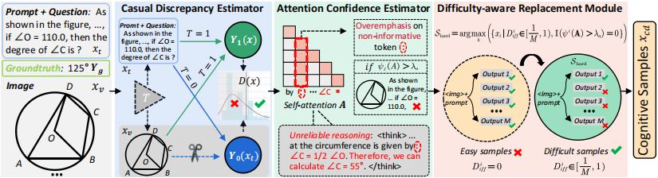

# RAP

## Introduction
This is the source code of "Truth in the Few: High-Value Data Selection for Efficient Multi-Modal Reasoning"


## Truth in the Few: High-Value Data Selection for Efficient Multi-Modal Reasoning
Our RAP model comprises three components: 1) Causal Discrepancy Estimator (CDE); 2) RAttention Confidence Estimator (ACE); and 3) Difficulty-aware Replacement Module (DRM).




## Proposed Model (RAP)
* Causal Discrepancy Estimator
* Attention Confidence Estimator
* Difficulty-aware Replacement Module


## Motivation

Illustrative examples of existing problems: (a) Language-prior biased samples (Figure a). (b) Attention-biased samples (Figure b).

## Results


## Requirements

### Software Requirements
We recommend using the [pre-built docker image](https://hub.docker.com/r/hiyouga/verl) in EasyR1.

```bash
docker pull hiyouga/verl:ngc-th2.6.0-cu120-vllm0.8.2
```
## Setup
```text
pip install -e .
```
### Get Selection File

```bash
set examples/config.yaml train.eval true
bash examples/qwen2_5_vl_7b_mmeureka_grpo.sh
```
### Selection

```bash
python select/selection.py
```
### GRPO Training

```bash
bash examples/qwen2_5_vl_7b_mmeureka_grpo.sh
```

### Merge Checkpoint in Hugging Face Format

```bash
python3 scripts/model_merger.py --local_dir checkpoints/exp_name/global_step_1/actor
```

### **Datasets：**

**MM-Eureka-Dataset:** Please download [MM-Eureka](https://huggingface.co/datasets/FanqingM/MM-Eureka-Dataset) and extract it in your data path.

**Mulberry Dataset**: Download these data from [Mulberry](https://huggingface.co/datasets/HuanjinYao/Mulberry-SFT) and extract it in your data path.

### Models:

Besides, you need to prepare the following checkpoints of base models:

- Download [Qwen2.5-VL-7B-Instruct](https://huggingface.co/Qwen/Qwen2.5-VL-7B-Instruct).
- Download [Qwen2.5-VL-3B-Instruct](https://huggingface.co/Qwen/Qwen2.5-VL-3B-Instruct).
- Download [InternVL3-2B](https://huggingface.co/OpenGVLab/InternVL3-2B).


## Evaluation
We recommend use [VLMEvalKit](https://github.com/open-compass/VLMEvalKit) to evaluate models.
```bash
torchrun --nproc-per-node=8 run.py --data WeMath --model Qwen2.5-VL-7B-Instruct --verbose
```
